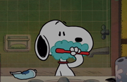
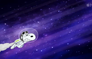

# Snoopy Screen Savers for macOS

Two self-contained video screen savers with silent looping playback, display-filling video, and Snoopy thumbnails.

| Screen saver | Preview | Length |
| --- | --- | --- |
| **Snoopy Morning Routine** |  | 30 seconds |
| **Snoopy Space** |  | About 35 seconds |

Both videos are **5120 × 2880**, upscaled from 1080p. This increases pixel dimensions, not original source detail. Video fills the display by cropping the edges when necessary, without stretching.

## Download and install

Download the installer ZIPs from [Releases](https://github.com/Numericss/Snoopy-SreenSaver/releases/latest):

- **Snoopy-Morning-Routine.zip**
- **Snoopy-Space.zip**

1. Unzip the package and double-click its `.saver` file.
2. Choose installation for your current user if prompted.
3. On macOS Tahoe, open **System Settings → Wallpaper → Screen Saver**. On earlier versions, open **System Settings → Screen Saver**.
4. Under **Other → Show All**, select the desired Snoopy screen saver.
5. Set a start delay if you want automatic playback.

The videos are embedded in each screen saver. No Internet connection or separate video file is needed. Both versions can be installed together.

If the installer does not open, copy the `.saver` into `~/Library/Screen Savers/` using Finder's **Go → Go to Folder**. Create that folder if needed, then reopen System Settings.

## Compatibility

- Universal binaries for Apple silicon and Intel Macs.
- Minimum target: macOS 13.
- Playback, looping, and fill layout tested on Apple silicon with macOS 26.7. Intel and other macOS versions have not been tested.
- These custom builds are ad-hoc signed, **not Apple-notarized**. macOS may require security approval before running downloaded screen savers.

## Troubleshooting

After replacing a screen saver, quit and reopen System Settings. If an old version continues playing or black bars remain, log out and back in so macOS reloads the screen saver host. A thumbnail may also remain cached until macOS refreshes its screen saver list.

To uninstall, move the relevant `.saver` from `~/Library/Screen Savers/` to Trash.

## Build from source

Requires macOS and Xcode Command Line Tools (`xcode-select --install`). The Swift code uses Apple's ScreenSaver, AppKit, and AVFoundation frameworks.

Provide a directory containing these prepared videos:

- `Morning Routine.mp4`
- `Snoopy Space.mp4`

The embedded videos can be obtained from the downloaded `.saver` packages with Finder's **Show Package Contents → Contents → Resources**. Videos and installer ZIPs are distributed as release assets rather than Git source files.

```sh
./scripts/build.sh /absolute/path/to/videos
```

The script builds both architectures, includes thumbnails, and ad-hoc signs the bundles. Results appear in `build/`. It preserves the supplied videos as-is and does not upscale or trim them.

## Credits and rights

This is an unofficial personal screen saver project, not an Apple or Peanuts product. Snoopy/Peanuts characters, Apple branding, and video content belong to their respective rights holders. This repository does not grant rights to that third-party content.
